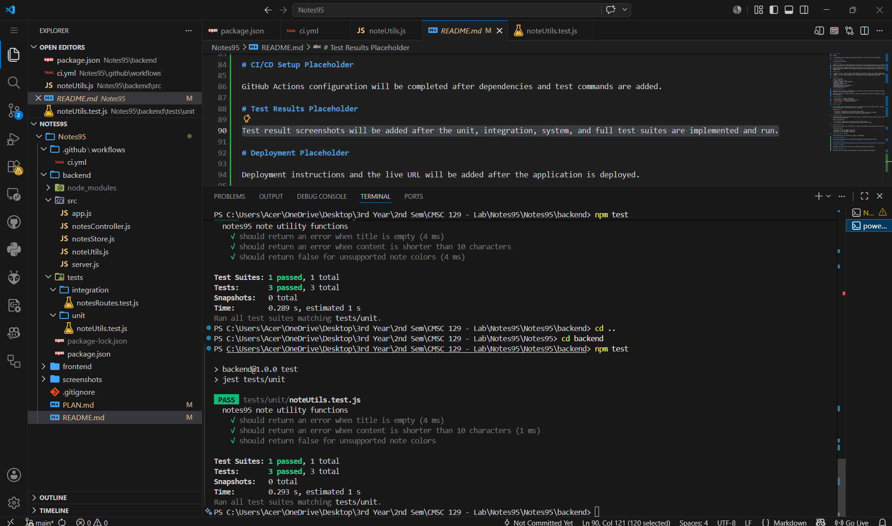
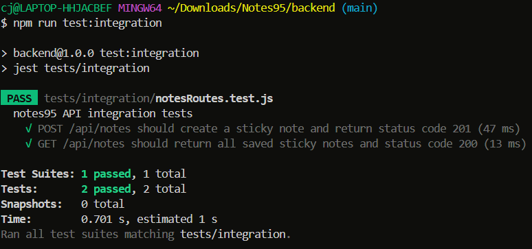
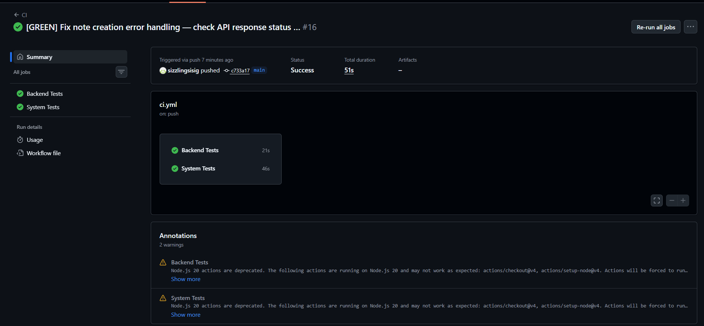

# Project Title

notes95

> A lightweight sticky note application inspired by Windows 95 UI - built with Test-Driven Development.

# Live URL

To be added after the first successful Vercel production deployment.

# App Description

notes95 is a single-resource CRUD web application that lets users create, update, and delete sticky notes displayed on a Windows 95-styled desktop canvas. Each note has a title, content body, and selectable background color: yellow, blue, green, or pink.

Notes are planned to be draggable locally during a session. The app will use React 19 with the React95 component library for the frontend and an Express 5 REST API for the backend. No database is required because data will be stored in a server-side in-memory array.

# User Stories

1. Create - As a user, I want to create a new sticky note on the desktop, so that I can quickly jot down a thought.
2. Update - As a user, I want to edit the title, content, and color of an existing note, so that I can keep my notes up to date.
3. Delete - As a user, I want to delete a note I no longer need, so that my desktop stays uncluttered.

# Tech Stack

| Layer | Technology |
|-------|------------|
| Frontend | React 19 + Vite |
| UI Library | React95 + styled-components |
| Backend | Express 5 |
| Data Store | In-memory array |
| Unit Testing | Jest |
| Integration Testing | Jest + Supertest |
| System/E2E Testing | Playwright |
| CI/CD | GitHub Actions + Vercel |

# Data Storage Approach

notes95 will use a server-side in-memory array as its data store. This keeps the project zero-setup and focused on CRUD behavior, API design, frontend interaction, and testing.

Because the data store is in memory, notes will reset when the backend server restarts. This behavior is acceptable for the scope of the lab project.

# Planned API Routes

- `GET /api/notes` - return all sticky notes
- `POST /api/notes` - create a new sticky note
- `PUT /api/notes/:id` - update an existing sticky note
- `DELETE /api/notes/:id` - delete a sticky note

# Testing Strategy

## Unit Testing

Unit tests will focus on isolated note-related logic. These tests will verify that the note title is required, the note content meets a minimum length, and the selected note color is allowed.

Planned unit tests:

- `validateNote()` should return an error when the title is empty.
- `validateNote()` should return an error when the content is shorter than the minimum length.
- `isAllowedColor()` should return true only for yellow, blue, green, and pink.

## Integration Testing

Integration tests will check complete HTTP request-response cycles between the Express routes, controller logic, validation logic, and in-memory data store.

Planned integration tests:

- `POST /api/notes` should create a sticky note and return status code 201.
- `GET /api/notes` should return all saved sticky notes and return status code 200.

## System/E2E Testing

System tests will simulate real user behavior in a browser using Playwright. Each system test will match one user story.

Planned system tests:

- User Story 1: A user can create a sticky note.
- User Story 2: A user can update a sticky note.
- User Story 3: A user can delete a sticky note.

# Setup Instructions

1. Clone the repository.
2. Install backend dependencies:

```bash
cd backend
npm install
```

3. Install frontend dependencies:

```bash
cd ../frontend
npm install
```

4. Run backend unit and integration tests:

```bash
cd ../backend
npm run test:all
```

5. Run the backend API locally:

```bash
npm start
```

6. In another terminal, run the frontend locally:

```bash
cd frontend
npm run dev
```

7. Run Playwright system tests:

```bash
cd frontend
npm run test:system
```

# CI/CD Setup

This project uses GitHub Actions for CI/CD. The workflow runs automatically on every push and pull request to `main` and `develop`.

The CI jobs install dependencies, run backend unit tests, run backend integration tests, install Playwright Chromium, and run the system tests through a real browser. This gives evidence for the Red-Green-Refactor process because Red commits should show failing workflow runs and Green commits should show passing workflow runs.

Deployment is handled by Vercel. The deployment job runs only on the `main` branch and only after both test jobs pass. The workflow uses these GitHub repository secrets:

- `VERCEL_TOKEN`
- `VERCEL_ORG_ID`
- `VERCEL_PROJECT_ID`

The Vercel multi-service setup is configured in the root-level `vercel.json`. The frontend service uses the `frontend` entrypoint and is served at `/`. The backend service uses the `backend` entrypoint and is served through `/_backend`, so frontend API calls use paths such as `/_backend/api/notes`.

# Test Results Placeholder




# Vercel Deployment

The project is prepared for Vercel multi-service deployment using the root `vercel.json` file. The frontend is deployed as a Vite app, while the backend is deployed as a separate service behind the `/_backend` route prefix.

After connecting the GitHub repository to Vercel, add the Vercel project values to GitHub Actions secrets, then push to `main`. If all unit, integration, and system tests pass, the deploy job publishes the production build.

# Reflection

Writing tests before code was difficult for our pair because it forced us to decide the expected behavior before seeing a working screen or route. We had to slow down and describe what a valid note should look like, what an API response should return, and what a user should be able to do in the browser. That felt less direct than immediately building the feature, but it made the scope clearer. The Red phase also helped us see whether a failure came from missing behavior instead of a broken test setup.

Working test-first changed how we designed the project. We separated note validation into utility functions so unit tests could exercise the rules without HTTP or browser setup. We kept the Express app export separate from the server startup so integration tests could send requests directly with Supertest. For the frontend, the Playwright tests pushed us to add stable `data-testid` attributes and user-focused flows for creating, editing, and deleting notes. As a pair, the process gave us a shared checklist for what was complete: a feature was not finished just because it appeared to work manually; it had to pass the test level that matched the behavior.
